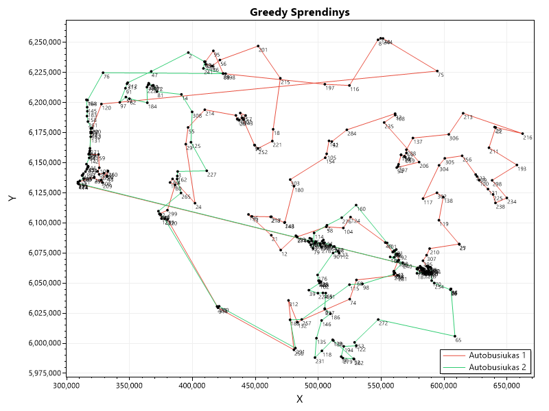
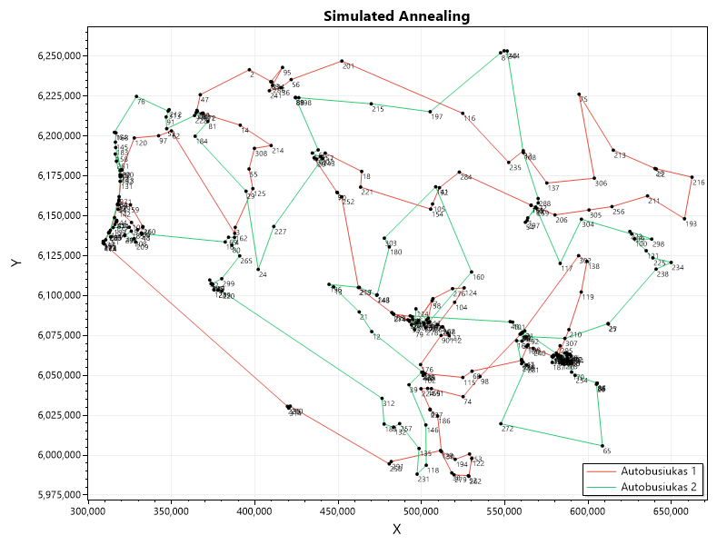

# Vehicle Routing Problem — Algorithm Comparison

A C# console application that solves the **Vehicle Routing Problem (VRP)** using four algorithms, comparing their solution quality and execution time. Built as a university engineering project at Kaunas University of Technology.

## Problem

Given **314 real named locations across Lithuania** (geographic data in the Lithuanian coordinate system EPSG:3346, loaded from Excel), find optimal routes for 2 buses starting and ending at a depot — minimising the longest single route across all buses.

## Algorithms Implemented

| Algorithm | Strategy | Time Limit |
|---|---|---|
| **Greedy** | Always picks the nearest unvisited location | ~instant |
| **Branch & Bound** | Exact optimal solution with pruning | 10s timeout |
| **Simulated Annealing** | Probabilistic metaheuristic, escapes local optima | 60s |
| **Parallel Simulated Annealing** | Multi-threaded SA across all CPU cores | 60s |

Branch & Bound finds the provably optimal solution but becomes infeasible beyond ~10 locations. SA and Parallel SA scale to the full dataset. Parallel SA reports a measured speedup factor vs single-threaded SA.

## Output

Each algorithm produces:
- Numbered bus routes (location sequence)
- Total distance per bus
- Maximum route distance (the optimisation target)
- A PNG route visualisation via ScottPlot




## How to Run

**Requirements:** .NET 8 SDK, input file `IP_places_data_2026.xlsx` in the project root.

```bash
dotnet run
```

Output PNGs are saved to the working directory.

## Tech Stack

- C# / .NET 8
- ExcelDataReader — Excel input parsing
- ScottPlot — route visualisation
- `Parallel.For` — multi-core parallelism

## Project Structure

```
Place.cs          — Location model with Euclidean distance
Route.cs          — Route model (path + cost)
DataLoader.cs     — Excel → List<Place> parser
Greedy.cs         — Nearest-neighbour heuristic
BranchAndBound.cs — Exact solver with upper-bound pruning (initialised with Greedy solution)
SimulatedAnnealing.cs  — SA with 2-opt + inter-route swap neighbourhood
ParallelSA.cs     — Parallel SA with per-thread independent random seeds
Visualizer.cs     — ScottPlot PNG output
Program.cs        — Entry point, benchmarks all four algorithms
```

## Results

Dataset: 314 locations, 2 buses, depot at location #67 (Gedimino pilis)

| Algorithm | Max Route Distance | Time |
|---|---|---|
| Greedy | 2,492,906.77 | 6.8 ms |
| Branch & Bound | optimal up to N=7 locations | timeout at N=8 (>10s) |
| Simulated Annealing | 2,079,072.00 | 60s |
| Parallel SA (12 cores) | 2,032,796.99 | 60s |

**SA vs Greedy improvement:** ~16.6% reduction in max route distance.

**Branch & Bound note:** Finds a provably optimal solution for small subsets but hits exponential complexity at N=8 within the 10s limit. This is expected behaviour for an NP-hard problem — the B&B result demonstrates the algorithm's correctness on tractable inputs before heuristics take over for the full dataset.

## Authors

Developed as part of the IP (Inžinerinis projektas) for Algorithm development and analysis module at KTU.  
**Kipras Rudzinskas** — algorithm implementation, parallelisation, visualisation.
